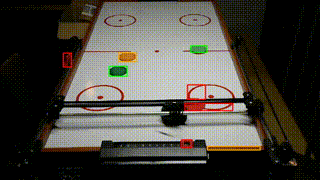

# airhobot - Air-Hockey Roboter #

  - wird später die Steuerung unseres AirHockey Tisches
  - Basiscode für unser Tech-Event am 02.02.2019
  - kann bisher noch gar nichts
  - alles noch wip und dirty

## core:

### Beispiele:

#### Puck detection

    cargo run --example detect-pucks

  * grüne pucks am besten
  * orange ist dem rand zu ähnlich
  * rot sind auch feld makrierungen

